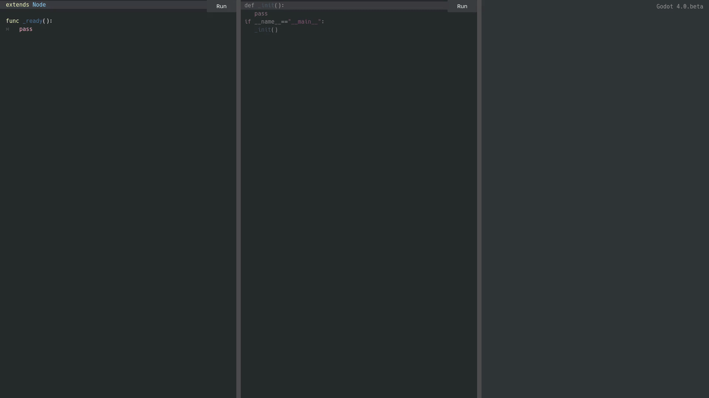

# GDScript to Python to C Transpiler

[](https://downloads.tuxfamily.org/godotengine/4.0/)
[](LICENSE.md)
[](https://www.python.org/)

[](icon.svg) 

`gdscript-transpiler-bin` is a GDScript compiler (using [Nuitka](https://github.com/Nuitka/Nuitka)), minimal scripts can be transpiled to Python.

Binary builds are compiled using [GitHub Actions](https://github.com/LinuxUserGD/GDScript2PythonTranspiler/actions) for Alpine Linux, macOS and Windows x86_64.

Other compatible platforms: Android (aarch64 and x86_64).

Also see [generated Python source from GDScript](https://github.com/LinuxUserGD/gdscript-transpiler-source).


[](preview.gif)

## Example

```
git clone https://codeberg.org/LinuxUserGD/gdscript-transpiler-bin.git

cd gdscript-transpiler-bin

git submodule update --init --remote --progress
```

### Godot Engine command line (stage0)

- `./godot4 -s bin/gds.gd --headless help`

- `./godot4 -s bin/gds.gd --headless run=bin/gds.gd` (for running GDScript directly using x-python)

- `./godot4 -s bin/gds.gd --headless format=bin/gds.gd` (for generating Python project)

- `./godot4 -s bin/gds.gd --headless compile=bin/gds.gd` (for compiling GDScript to binary using Clang and Nuitka)

### Python environment (stage1)
Installing python gds
```
python -m pip install git+https://github.com/LinuxUserGD/gdscript-transpiler-source.git
```

- `python -m gdspy help`

- `python -m gdspy run=bin/gds.gd`

- `python -m gdspy format=bin/gds.gd`

- `python -m gdspy compile=bin/gds.gd`

### Nuitka compiled binary (stage2)
Installing gds binary (available at [itch.io](https://linuxusergd.itch.io/gdscript-transpiler-bin))
```
unzip gdscript-transpiler-bin.zip
cd gdscript-transpiler-bin
chmod +x gds
```

- `./gds[.exe] help`

- `./gds[.exe] run=bin/gds.gd`

- `./gds[.exe] format=bin/gds.gd`

- `./gds[.exe] compile=bin/gds.gd`

## Benchmark

Time for running GDScript code:

```gdscript
func string() -> int:
	var x: String = ""
	for i in range(0, 300000):
		x += " "
	return x.length()

func add() -> int:
	var x: int = -100000000
	for i in range(0, 100000000):
		x += 1
	return x
```

|              | Godot      | Python     | Nuitka
|--------------|------------|------------|------------
| benchmark.gd | 11.639s    | 4.678s     | 1.857s

## License

### See [LICENSE](LICENSE.md) and [CREDITS](CREDITS.md) (third-party licenses)
