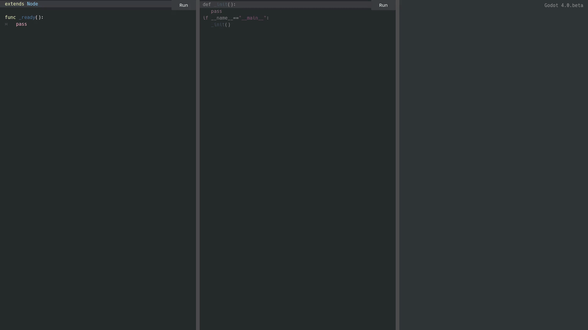

# GDScript to Python to C Transpiler

<h2>gdscript-transpiler-bin</h2>

A GDScript compiler and Python runtime environment.
Minimal Scripts can be transpiled to Python.

Binary builds are compiled with [Nuitka](https://github.com/Nuitka/Nuitka):
- https://linuxusergd.itch.io/gdscript-transpiler-bin, [GitHub Actions](https://github.com/LinuxUserGD/GDScript2PythonTranspiler/actions)

For Python script generated from [`main.gd`](gdscript-transpiler-bin/main.gd), see [LinuxUserGD/main.py](https://gist.github.com/LinuxUserGD/73d8e030a44eb7f91bdeaea96a321f6d).

## License

### See [LICENSE](LICENSE) and [CREDITS](CREDITS) (third-party licenses)